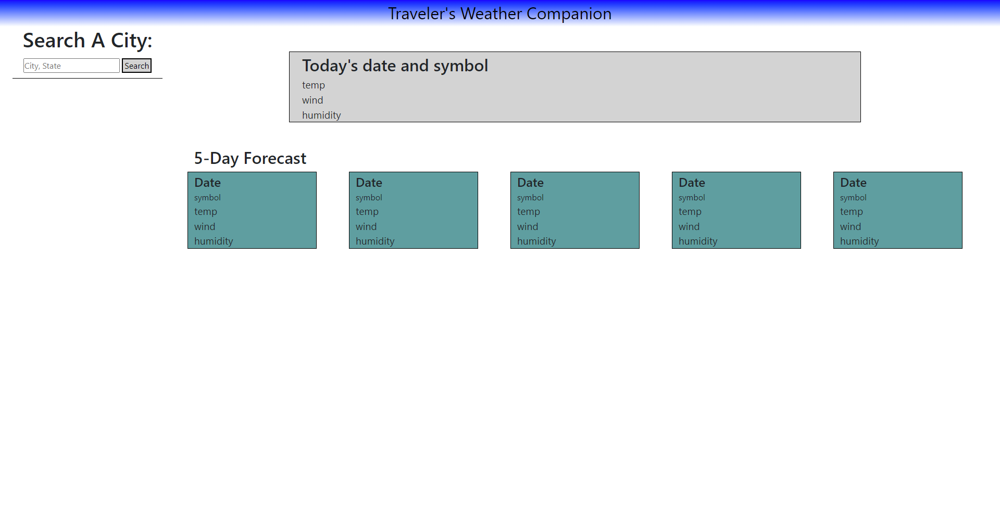

# Traveler's Weather Companion
(Note: API key was locked from a bad loop I made during the page creation. I sent an email to unlock it with no response as of this moment.)

https://jaystepz.github.io/Traveler-Weather-Companion/
## Overview
Use this to check the current weather and 5-day forecast of any city in the US.
## How to Use
Simple usage: Type the name of the city you want to check the weather of, then click the search button!
The current weather will display in the top box along with today's date and the city name.
The 5-day forecast will display in the lower 5 boxes along with the respective dates.
Every search will also display a history underneath the search button for each search.
(Those buttons don't currently work, though. My apologies.)
## Credits
Shoutout to Brandon for making his return in helping me out, and W3schools for general info/reference.